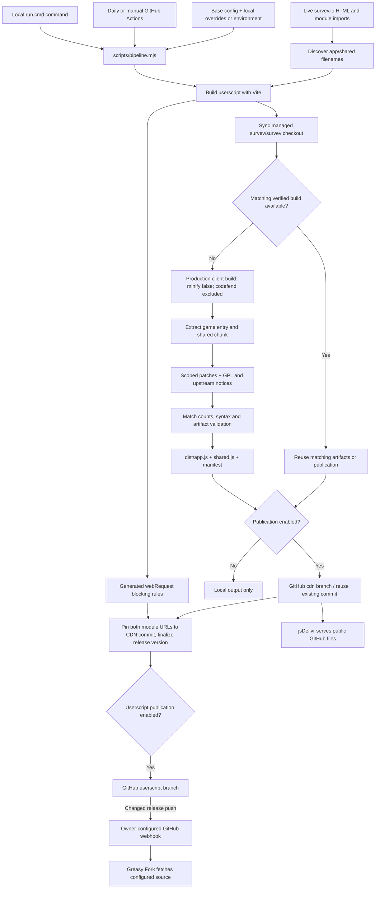
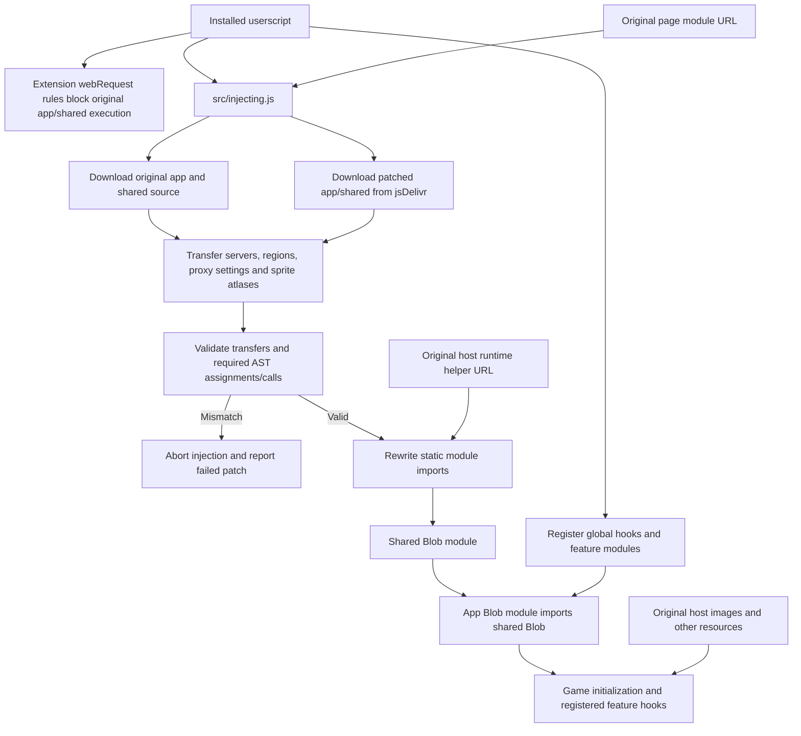
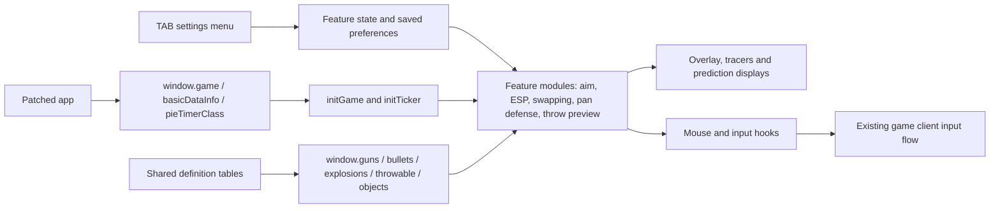

# Architecture

[Back to README](../README.md) · [Development guide](development.md) · [Userscript internals](../userscript/README.md)

PrismCheat has two parts: a build and publication pipeline, and a userscript that adapts the published modules to the current game page. GitHub renders the Mermaid diagrams below directly.

## Build and publication

The diagram describes an update cycle. `check` is read-only; `userscript` stops after the userscript build. A failed preflight or patch validation stops publication. Unchanged releases do not create another push. Greasy Fork synchronization is an external account setting, not a direct upload performed by this pipeline.

## Browser loading and adaptation

Blocking depends on extension support and filenames discovered at build time. Injection cannot undo an original module that has already executed. Localhost builds with different hashes need matching blocking rules. The two CDN JavaScript files are not a standalone game: runtime helpers and assets still come from the original host.

## Runtime responsibilities

Client-visible state drives predictions; unreplicated server information is not available. Structural patch checks detect missing integration points, but do not prove gameplay accuracy. See [combat limitations](combat-details.md).

## Source map

| Responsibility | Main source |
| --- | --- |
| Commands, caching and publication | [pipeline.mjs](../scripts/pipeline.mjs) |
| Configuration and metadata | [config.mjs](../scripts/config.mjs) |
| Client build and chunk selection | [build-client.mjs](../scripts/build-client.mjs) |
| Build-time transformations | [app-patches.mjs](../scripts/app-patches.mjs), [shared-patches.mjs](../scripts/shared-patches.mjs) |
| Userscript build and live discovery | [vite.config.js](../userscript/vite.config.js), [discover-scripts.mjs](../userscript/scripts/discover-scripts.mjs) |
| Browser module adaptation | [injecting.js](../userscript/src/injecting.js) and adjacent transfer modules |
| Runtime patch checks | [patchValidation.js](../userscript/src/patchValidation.js) |
| Settings and feature state | [iceHackMenu.js](../userscript/src/iceHackMenu.js), [vars.js](../userscript/src/vars.js) |

Local publication settings are ignored by Git. Forks do not inherit the original owner's webhook or credentials. Published userscripts pin app/shared to the same commit; branch URLs used by local builds can be cached.
